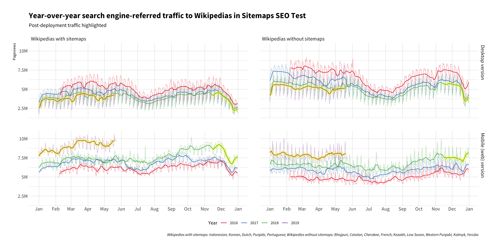

# Casual impact analysis of sitemaps on search-referred visits

## File organization

1. **Data acquisition**
  1. [data/fetch.R](data/fetch.R) queries traffic data with Hive
  2. [refine.R](refine.R) collects and refines the fetched data
2. **Exploratory data analysis**
  - [eda.R](eda.R) was some scratch work I did
  - [analysis-mm.R](analysis-mm.R) was some scratch work I did with {[MarketMatching](https://cran.r-project.org/package=MarketMatching)} package
3. **Statistical modeling**
  1. [data.R](data.R) loads and prepares data
  2. [functions.R](functions.R) includes functions for fitting a BSTS model and getting predictions in a tidy form
  3. [cross-validation.R](cross-validation.R) performs nested CV to estimate MAPE
  4. [analysis.R](analysis.R) fits model, estimates impact, and visualizes it
